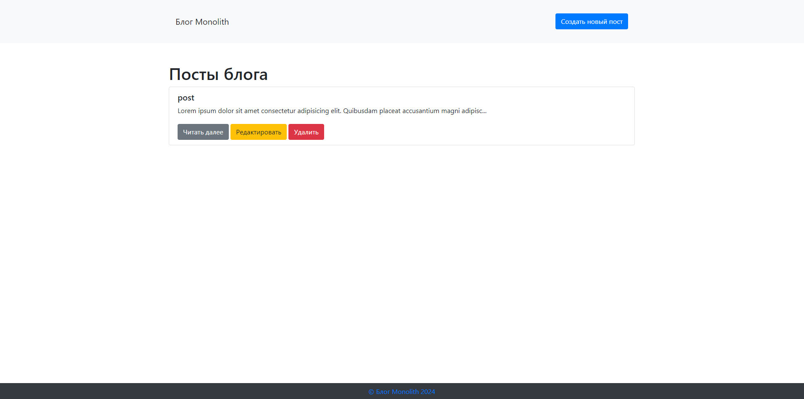
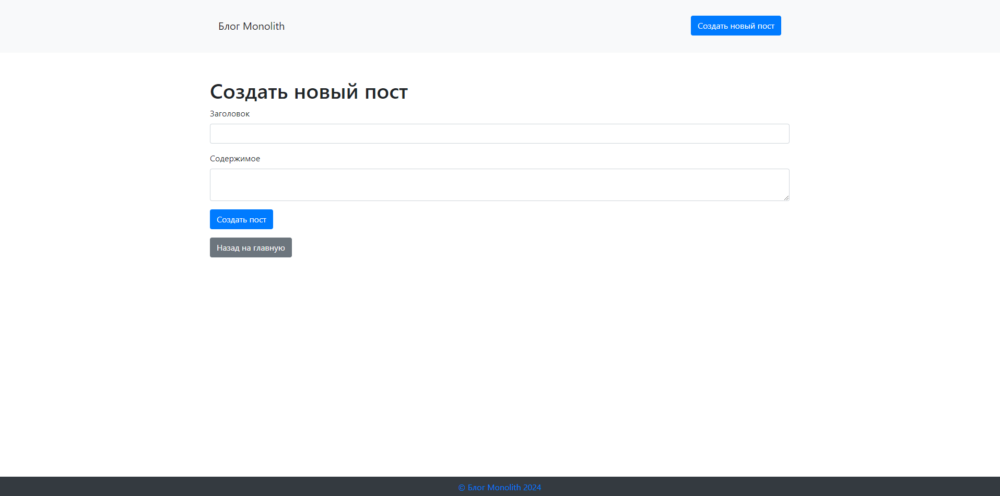
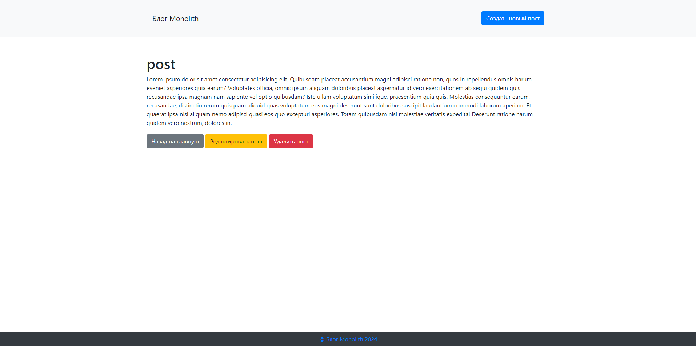
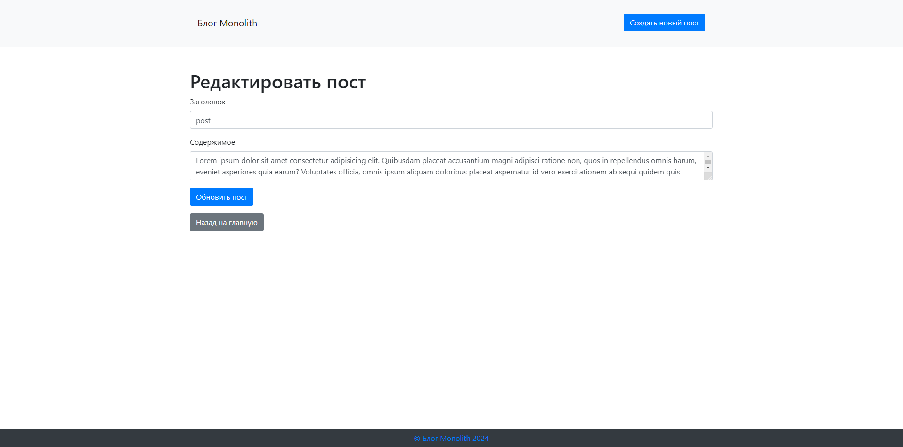
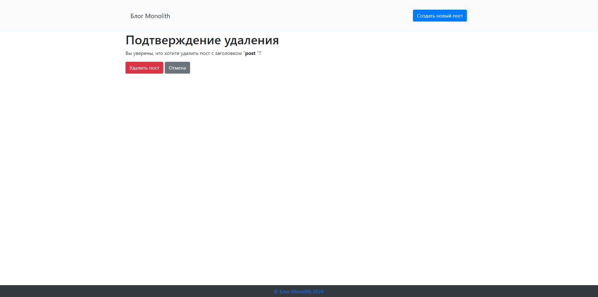

# Описание проекта

Этот проект представляет собой простое веб-приложение блога, разработанное с использованием FastAPI и SQLAlchemy.
Приложение позволяет пользователям создавать, редактировать и удалять посты блога, а также просматривать список всех
постов и отдельные посты.

## Доступный функционал

- Просмотр списка всех постов блога.
- Чтение полного текста поста.
- Создание нового поста.
- Редактирование существующего поста.
- Удаление поста с подтверждением.

# Скриншоты

## Главная страница



## Страница создания нового поста



## Страница для просмотра поста



## Страница редактирования поста



## Подтверждение удаления поста



# Установка

## 1. Клонируйте репозиторий:

```bash
git clone https://github.com/markup-dev/fast-api-blog.git
cd blog
```

## 2. Создайте виртуальное окружение (рекомендуется):

```bash
python -m venv .venv
source .venv/bin/activate  # Для Linux/MacOS
.venv\Scripts\activate     # Для Windows
```

## 3. Установите необходимые зависимости:

```bash
pip install -r requirements.txt
```

## 4. Запустите приложение:

```bash
uvicorn main:app --reload
```

# Использование

1. Откройте браузер и перейдите по адресу http://127.0.0.1:8000.
2. На главной странице вы увидите список всех постов блога.
3. Чтобы создать новый пост, нажмите кнопку "Создать новый пост".
4. Заполните форму заголовка и содержимого, затем нажмите "Создать пост".
5. Для редактирования или удаления поста воспользуйтесь соответствующими кнопками рядом с каждым постом.

## Использованные технологии

- **FastAPI**: Веб-фреймворк для создания API на Python.
- **SQLAlchemy**: ORM для работы с базами данных.
- **SQLite**: Легковесная реляционная база данных для хранения данных блога.
- **Jinja2**: Шаблонизатор для генерации HTML страниц.
- **Bootstrap**: CSS-фреймворк для стилизации интерфейса.